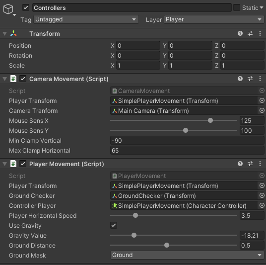

# Unity_SimpleCharacterController_FPS
Simple and quick FPS movement, great for walking simulators and easily scalable for other projects! Have Fun!

## Create a ground mask for your environment!
## Drag and drop prefab into scene (it comes with its camera already)!

#### Tweak the settings for your liking.

